# Mystery Lottery Game Flow Documentation

## Overview

This document provides a comprehensive visual guide to the Mystery Lottery system, showing how creators and participants interact with the platform through sequence diagrams, state machines, and flowcharts.

## Table of Contents

1. [Creator Flow](#creator-flow)
2. [Participant Flow](#participant-flow)
3. [Lottery State Machine](#lottery-state-machine)
4. [Randomness Generation](#randomness-generation)
5. [Prize Assignment Algorithm](#prize-assignment-algorithm)
6. [System Architecture](#system-architecture)
7. [Lottery Timeline](#lottery-timeline)

---

## Creator Flow

The creator journey from lottery creation to prize distribution:

```mermaid
sequenceDiagram
    participant Creator
    participant Frontend
    participant SmartContract
    participant Blockchain

    Note over Creator,Blockchain: Phase 1: Creation
    Creator->>Frontend: Configure lottery (prizes, tickets, deadlines)
    Frontend->>Frontend: Generate creator secret
    Frontend->>Frontend: Generate ticket secrets & hashes
    Frontend->>Frontend: Create commitment = hash(creator secret)
    Creator->>Frontend: Approve USDC deposit
    Frontend->>SmartContract: createLottery(commitment, ticketHashes, prizes, deadlines)
    SmartContract->>Blockchain: Transfer USDC from creator
    SmartContract->>SmartContract: Store lottery data
    SmartContract->>SmartContract: Set state = CommitOpen
    SmartContract-->>Frontend: Return lotteryId
    Frontend-->>Creator: Display ticket codes & QR codes
    Note over Creator: ⚠️ MUST SAVE CREATOR SECRET!

    Note over Creator,Blockchain: Phase 2: Distribution
    Creator->>Creator: Share ticket codes via QR/links

    Note over Creator,Blockchain: Phase 3: Waiting Period
    Note over Creator: Wait for commit deadline to pass
    Note over Creator: Wait for reveal time to arrive
    Note over Creator: Monitor committed ticket count

    Note over Creator,Blockchain: Phase 4: Reveal
    Creator->>Frontend: Enter creator secret
    Frontend->>Frontend: Verify hash(secret) === commitment
    Creator->>Frontend: Confirm reveal
    Frontend->>SmartContract: revealLottery(lotteryId, creatorSecret)
    SmartContract->>SmartContract: Verify secret matches commitment
    SmartContract->>SmartContract: Check committedCount >= 1
    SmartContract->>SmartContract: Generate randomness from secrets
    SmartContract->>SmartContract: Assign prizes to committed tickets
    SmartContract->>SmartContract: Set state = RevealOpen
    SmartContract->>SmartContract: Set claimDeadline = now + 24h
    SmartContract-->>Frontend: Emit LotteryRevealed event
    Frontend-->>Creator: Show prize assignments

    Note over Creator,Blockchain: Phase 5: Monitoring
    Creator->>Frontend: Monitor claims
    Note over Creator: Wait 24 hours for claim period

    Note over Creator,Blockchain: Phase 6: Finalization
    Creator->>Frontend: Finalize lottery (after claim deadline)
    Frontend->>SmartContract: finalizeLottery(lotteryId)
    SmartContract->>SmartContract: Move unclaimed prizes to rollover
    SmartContract->>SmartContract: Set state = Finalized
    SmartContract-->>Frontend: Emit PrizesForfeited event
    Frontend-->>Creator: Show final results & rollover amount
```



**Key Timing Constraints:**
- **Commit Deadline**: Participants must commit before this time
- **Reveal Time**: Creator can reveal after this time (must be >= commit deadline)
- **Claim Deadline**: Automatically set to 24 hours after reveal
- **Refund Window**: If creator doesn't reveal within 24h of reveal time, participants can request refunds

---

## Participant Flow

The participant journey from receiving a ticket to claiming a prize:

```mermaid
sequenceDiagram
    participant Participant
    participant Frontend
    participant SmartContract
    participant Blockchain

    Note over Participant,Blockchain: Phase 1: Receive Ticket
    Participant->>Frontend: Scan QR code or click link
    Frontend->>Frontend: Parse URL params (lotteryId, ticketIndex, secret)
    Frontend->>SmartContract: Read lottery data
    SmartContract-->>Frontend: Return lottery info
    Frontend-->>Participant: Display lottery details & deadlines

    Note over Participant,Blockchain: Phase 2: Commit
    Participant->>Frontend: Click "Enter Draw"
    Frontend->>Frontend: Hash ticket secret
    Frontend->>SmartContract: commitTicket(lotteryId, ticketIndex, secretHash)
    SmartContract->>SmartContract: Verify deadline not passed
    SmartContract->>SmartContract: Verify secret hash matches
    SmartContract->>SmartContract: Store commitment with participant address
    SmartContract-->>Frontend: Emit TicketCommitted event
    Frontend-->>Participant: Show success + countdown to reveal

    Note over Participant,Blockchain: Phase 3: Wait for Reveal
    Note over Participant: Wait for creator to reveal
    Note over Participant: Receive notification when revealed

    Note over Participant,Blockchain: Phase 4: Check Prize
    Participant->>Frontend: Return to ticket page
    Frontend->>SmartContract: Read ticket prize amount
    SmartContract-->>Frontend: Return prizeAmount
    alt Won Prize
        Frontend-->>Participant: 🎉 Show prize amount + confetti
    else No Prize
        Frontend-->>Participant: "Better luck next time!"
    end

    Note over Participant,Blockchain: Phase 5: Claim Prize (if won)
    alt Prize > 0
        Participant->>Frontend: Click "Claim Prize"
        Frontend->>Frontend: Calculate net prize (gross - gas)
        Frontend->>SmartContract: claimPrize(lotteryId, ticketIndex, secret)
        SmartContract->>SmartContract: Verify secret matches hash
        SmartContract->>SmartContract: Verify not already claimed
        SmartContract->>SmartContract: Calculate gas cost in USDC
        SmartContract->>Blockchain: Transfer net prize to participant
        SmartContract->>Blockchain: Refund gas to tx.origin
        SmartContract->>SmartContract: Mark ticket as redeemed
        SmartContract-->>Frontend: Emit PrizeClaimed event
        Frontend-->>Participant: Show success + share buttons
    else Prize = 0
        Note over Participant: No claim needed
    end
```

**Decision Points:**
- **Won vs Lost**: Determined by prize assignment during reveal
- **Claim vs Forfeit**: Participant must claim within 24 hours or prize goes to rollover
- **Committed vs Not Committed**: Only committed tickets are eligible for prizes

---

## Lottery State Machine

The lifecycle of a lottery through its various states:


**Who Can Trigger Transitions:**
- `Pending → CommitOpen`: Automatic (on creation)
- `CommitOpen → RevealOpen`: Creator only (via revealLottery)
- `CommitOpen → Finalized`: Anyone (via refundLottery, if 24h past reveal time)
- `RevealOpen → Finalized`: Anyone (via finalizeLottery, after claim deadline)

---

## Randomness Generation

How the system generates fair, unpredictable randomness:


**Security Properties:**
1. **Creator Cannot Manipulate Alone**: Secret committed before tickets distributed
2. **Participants Cannot Predict**: Don't know creator secret or other participants' tickets
3. **Collusion Resistant**: Requires knowing ALL participants' secrets to predict outcome
4. **Deterministic**: Same inputs always produce same output (verifiable)
5. **Minimum Entropy**: At least 1 participant required for meaningful randomness

**Entropy Sources:**
- Creator secret (256 bits)
- Each committed ticket hash (256 bits each)
- Combined via keccak256 for final seed

---

## Prize Assignment Algorithm

Prize-centric assignment for O(M) complexity:

```mermaid
flowchart TD
    Start([Begin Prize Assignment]) --> BuildArray[Build array of<br/>committed ticket indices]
    BuildArray --> InitVars[remainingTickets = array.length<br/>prizeIndex = 0]
    
    InitVars --> CheckPrizes{More prizes<br/>to assign?}
    CheckPrizes -->|No| Done([Assignment Complete])
    CheckPrizes -->|Yes| CheckTickets{remainingTickets<br/>> 0?}
    
    CheckTickets -->|No| Rollover[Prize → rollover pool]
    Rollover --> NextPrize[prizeIndex++]
    NextPrize --> CheckPrizes
    
    CheckTickets -->|Yes| GenRandom[Generate random index:<br/>keccak256seed, prizeIndex<br/>% remainingTickets]
    GenRandom --> SelectWinner[winningTicket =<br/>committedTickets[randomIndex]]
    SelectWinner --> AssignPrize[Assign prize to<br/>winningTicket]
    
    AssignPrize --> RemoveWinner[Remove winner from pool:<br/>swap with last element]
    RemoveWinner --> DecrementCount[remainingTickets--]
    DecrementCount --> IncrementPrize[prizeIndex++]
    IncrementPrize --> CheckPrizes
    
    style BuildArray fill:#e1f5e1
    style GenRandom fill:#fff4e1
    style SelectWinner fill:#fff4e1
    style AssignPrize fill:#e1f5e1
    style Rollover fill:#ffe1e1
```

**Algorithm Advantages:**
- **O(M) Complexity**: Only iterate through M prizes, not N tickets
- **Gas Efficient**: 97% gas savings vs Fisher-Yates shuffle (60k vs 2M gas)
- **Fair**: Each ticket has equal probability of winning each prize
- **Simple**: No complex shuffle implementation needed
- **Handles Edge Cases**: Naturally cascades prizes when pool exhausted

**Example:**
- 100 tickets, 3 prizes, 50 committed
- Traditional: Shuffle 100 tickets (O(N)) = ~2M gas
- Prize-centric: Select 3 winners (O(M)) = ~60k gas
- Savings: 97%

---

## System Architecture

High-level component interaction:


**Data Flow for Key Operations:**

**Create Lottery:**
1. UI: User inputs prizes, tickets, deadlines
2. Crypto: Generate creator secret & ticket secrets (off-chain)
3. Hooks: Call createLottery with commitment & hashes
4. Viem: Send transaction via wallet
5. Contract: Store lottery data, transfer USDC
6. Events: LotteryCreated emitted
7. UI: Display ticket codes & QR codes

**Commit Ticket:**
1. UI: User scans QR or clicks link
2. Hooks: Parse ticket data from URL
3. Crypto: Hash ticket secret
4. Hooks: Call commitTicket
5. Contract: Verify & store commitment
6. Events: TicketCommitted emitted
7. UI: Show success message

**Reveal Lottery:**
1. UI: Creator enters secret
2. Crypto: Verify hash matches commitment
3. Hooks: Call revealLottery
4. Contract: Generate randomness, assign prizes
5. Events: LotteryRevealed emitted
6. UI: Show prize assignments

**Claim Prize:**
1. UI: Winner clicks claim
2. Hooks: Call claimPrize with secret
3. Contract: Verify, calculate net prize, transfer USDC
4. Events: PrizeClaimed emitted
5. UI: Show success + confetti

**Off-Chain Components:**
- Secret generation (Web Crypto API)
- QR code generation (qrcode.react)
- Ticket URL encoding
- Local storage for ticket tracking

---

## Lottery Timeline

Visual representation of key deadlines and windows:

```mermaid
gantt
    title Lottery Lifecycle Timeline
    dateFormat X
    axisFormat %H:%M
    
    section Creation
    Lottery Created           :milestone, m1, 0, 0m
    
    section Commit Period
    Commit Window Open        :active, commit, 0, 120m
    Participants Commit       :crit, 0, 120m
    Commit Deadline           :milestone, m2, 120, 0m
    
    section Waiting Period
    Wait for Reveal Time      :wait, 120, 60m
    Reveal Time Reached       :milestone, m3, 180, 0m
    
    section Reveal Window
    Creator Can Reveal        :active, reveal, 180, 1440m
    Refund Window Opens       :crit, 1620, 0m
    (24h after reveal time)
    
    section Claim Period
    Prizes Revealed           :milestone, m4, 240, 0m
    Claim Window (24h)        :active, claim, 240, 1440m
    Claim Deadline            :milestone, m5, 1680, 0m
    
    section Finalization
    Finalize Lottery          :done, final, 1680, 60m
    Lottery Complete          :milestone, m6, 1740, 0m
```

**Timeline Breakdown:**

**T+0: Creation**
- Lottery created
- State: Pending → CommitOpen
- Commit period begins

**T+0 to Commit Deadline: Commit Period**
- Participants can commit tickets
- Creator distributes ticket codes
- Duration: Set by creator (e.g., 2 hours, 1 day, 1 week)

**Commit Deadline to Reveal Time: Waiting Period**
- No commits allowed
- Creator waits for reveal time
- Duration: Set by creator (can be 0 for immediate reveal)

**Reveal Time: Reveal Window Opens**
- Creator can now reveal lottery
- Must have at least 1 committed ticket
- Creator has unlimited time to reveal (but see refund window)

**Reveal Time + 24h: Refund Window Opens**
- If creator hasn't revealed, participants can request refunds
- Anyone can call refundLottery()
- Prize pool returned to creator
- State: CommitOpen → Finalized

**Reveal: Claim Period Begins**
- Prizes assigned to committed tickets
- State: CommitOpen → RevealOpen
- Claim deadline set to reveal time + 24 hours
- Winners have 24 hours to claim

**Claim Deadline: Finalization**
- Anyone can call finalizeLottery()
- Unclaimed prizes moved to rollover pool
- State: RevealOpen → Finalized
- Lottery complete

**Key Windows:**
- **Commit Window**: Creation → Commit Deadline
- **Reveal Window**: Reveal Time → ∞ (or until refund)
- **Claim Window**: Reveal → Claim Deadline (24h)
- **Refund Window**: Reveal Time + 24h → ∞ (if not revealed)

---

## Summary

This documentation provides a complete visual guide to the Mystery Lottery system:

1. **Creator Flow**: End-to-end journey from creation to finalization
2. **Participant Flow**: Ticket redemption and prize claiming
3. **State Machine**: Lottery lifecycle and transitions
4. **Randomness**: Multi-party commit-reveal mechanism
5. **Prize Assignment**: Efficient O(M) algorithm
6. **Architecture**: System components and data flow
7. **Timeline**: Key deadlines and windows

For implementation details, see:
- `contract/src/LotteryFactory.sol` - Smart contract
- `fe/src/hooks/` - Frontend hooks
- `.kiro/specs/mystery-lottery/design.md` - Detailed design
- `.kiro/specs/randomness-migration/` - Randomness migration details
